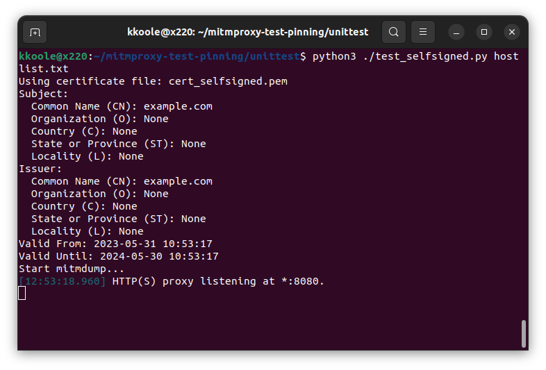

# mitmproxy-test-pinning

This repository contains a collection of various mitmproxy addons and python wrapper scripts for using mitmproxy/mitmdump to test certificate pinning misimplementations.

The original idea was to write a custom addon to dynamically generate a certificate while performing what is called 'upstream certificate sniffing', though we encountered difficulties with using the correct mitmproxy hooks and manipulating the TLS session before it is established.

https://github.com/mitmproxy/mitmproxy/issues/6149

Alternatively, we implemented a python wrapper to start `mitmdump` with a dynamically generated self-signed certificate. A disadvantage of this approach is that we are not able to sniff upstream certificates to dynamically generate the certificates, instead a list of hostnames or alternatively attributes is used to perform certificate generation.

## Getting started

The addons in this repository were written for mitmproxy version 9.0.1.

First download mitmproxy 9.0.1 from https://mitmproxy.org/downloads/#9.0.1/

Next clone the repository

```git clone https://github.com/kkoole/mitmproxy-test-pinning``` 

## Usage

The addons can be used with mitmproxy as follows.

```mitmproxy -s /path/to/repo/client_hello_addon.py```

The python wrapper script requires that mitmdump is placed within the script directory. Next the script can be used as follows.

```cd unittest```

```./test_selfsigned.py ./hostlist.txt```

After performing the test the next test can be started using ```CTRL+C```.


